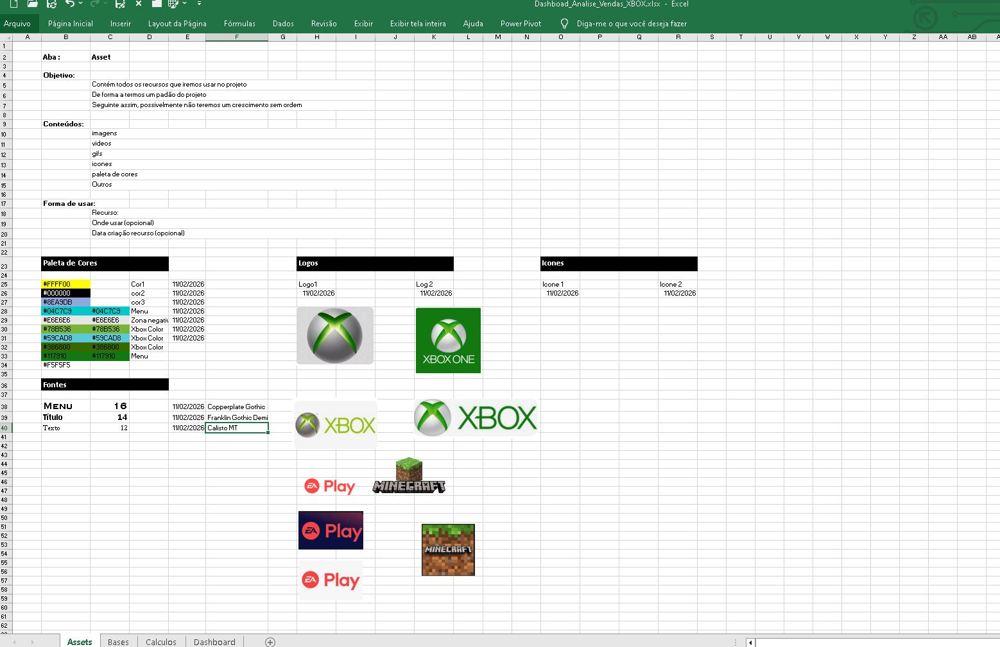
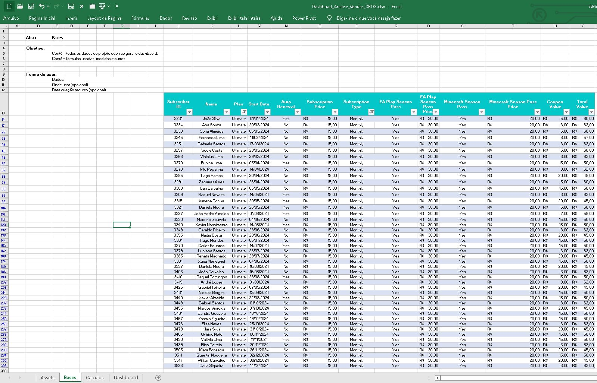
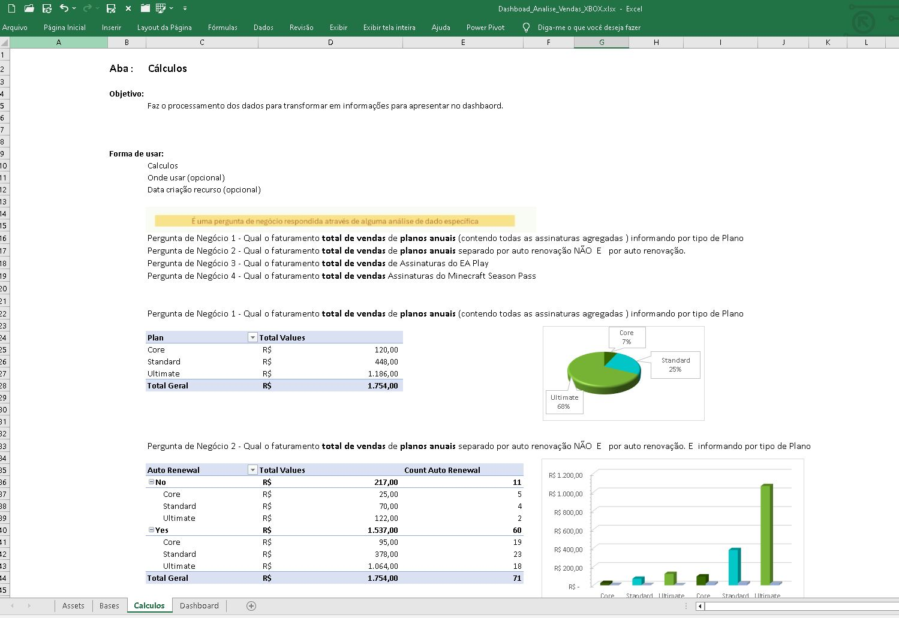
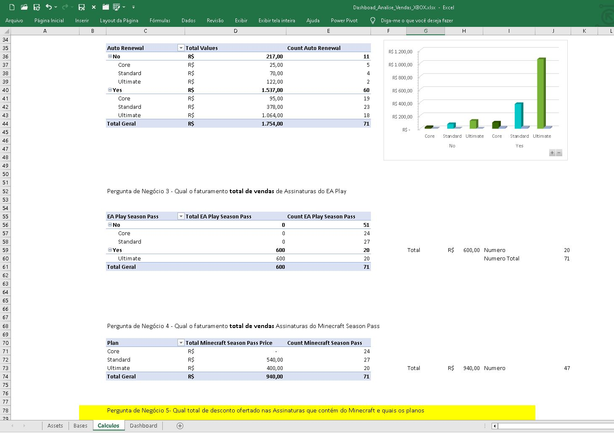
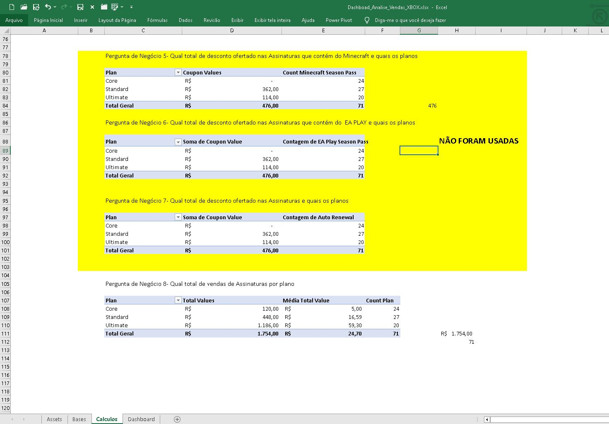
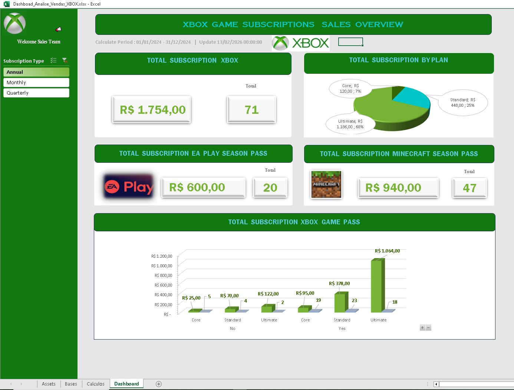
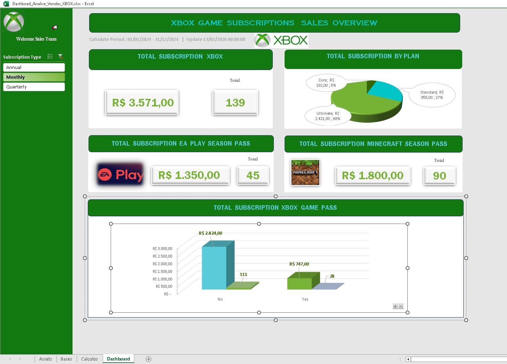

# Dio_Excel_Dashboard_Vendas

Projeto de estudo utilizando Excel versão 2016 para criar um dashboard com uma base de dados de vendas de produtos da microsoft. 

# 🎮 Dashboard de Vendas Xbox — Excel 2016

-

---

## 📌 Sumário

- [Objetivo do Projeto](#-objetivo-do-projeto)
- [Visão Geral](#-visão-geral)
- [Contexto de Negócio](#-contexto-de-negócio)
- [Arquitetura da Solução](#-arquitetura-da-solução)
- [Estrutura das Abas](#-estrutura-das-abas)
- [Funcionalidades do Dashboard](#-funcionalidades-do-dashboard)
- [Segmentação e Navegação](#-segmentação-e-navegação)
- [Indicadores e Gráficos](#-indicadores-e-gráficos)
- [Onde Atualizar os Dados](#-onde-atualizar-os-dados)
- [Competências Demonstradas](#-competências-demonstradas)
- [Estrutura do Repositório](#-estrutura-do-repositório)

---

# 🎯 Objetivo do Projeto

Atender ao desafio proposto pela DIO:

Criar um Dashboard de Vendas no Excel com foco em organização,
visualização e análise estratégica de dados.

Entrega estruturada em formato profissional de portfólio.

---

# 📊 Visão Geral

Dashboard desenvolvido em Excel 2016 com foco na consolidação e análise da base de vendas do produto **Xbox (Microsoft)**.

O projeto transforma dados brutos em:

- Indicadores estratégicos
- Análises comparativas
- Visualizações executivas
- Insights para tomada de decisão

Modelo estruturado com separação clara entre:

Base de Dados → Processamento → Visualização Executiva

---

# 💼 Contexto de Negócio

O dashboard simula um cenário corporativo onde é necessário:

- Monitorar performance de vendas
- Identificar produtos mais rentáveis
- Avaliar diferenças e tendências temporais dos produtos
- Apoiar decisões comerciais e financeiras

Aplicação prática:

✔ Controle gerencial  
✔ Análise de desempenho  
✔ Planejamento estratégico  
✔ Apoio à área financeira  

---

# 🏗 Arquitetura da Solução

A modelagem foi construída em camadas:

| Camada | Finalidade |
|--------|------------|
| Assets | Elementos visuais (cores, ícones, identidade) |
| Base | Dados brutos de vendas |
| Cálculo | Tabelas Dinâmicas, consolidações, gráficos e fórmulas |
| Dashboard | Dashboard interativo |

Essa arquitetura evita mistura entre dados e visualização, gera maior produtividade todas as vezes que for necessário revisitar o projeto.

---

# 📑 Estrutura das Abas

## 🔹 Tab Asset
Contém:
- Paleta de cores
- Ícones
- Elementos gráficos
- Identidade visual

Responsável pela padronização estética.

  

---

## 🔹 Tab Base
Base de dados principal.

Contém:
- Produto
- Data
- Quantidade vendida
- Receita
- Categoria

É a única aba que deve ser atualizada com novos dados.

  

---

## 🔹 Tab Cálculo
Camada de processamento.

Contém:
- Tabelas Dinâmicas
- Consolidações
- KPIs
- Estrutura dos gráficos

Não deve ser editada manualmente.

  

- 

  

- 

 

---

## 🔹 Tab Dashboard
Camada visual final.

Integra:
- Gráficos
- Indicadores
- Segmentações
- Cards executivos

Simula ambiente de BI.

- 

 

- 
 
 

---

# 📈 Funcionalidades do Dashboard

O painel apresenta:

### KPIs principais
- Receita Total
- Volume de Vendas
- Crescimento por período

### Análises
- Receita por Produto
- Evolução temporal de vendas
- Comparativo entre categorias

---

# 🎛 Segmentação e Navegação

O dashboard utiliza **Segmentações (Slicers)** conectadas às Tabelas Dinâmicas.

Permite:

- Filtrar por Período

Benefícios:

✔ Navegação intuitiva  
✔ Atualização dinâmica dos gráficos  
✔ Integração total entre indicadores  

A segmentação atua como mecanismo central de integração visual.

---

# 📊 Indicadores e Gráficos

Tipos aplicados:

- 📊 Colunas → Comparativo de Receita por Região
- 📈 Linha → Evolução Mensal de Vendas
- 🥧 Pizza → Distribuição por Categoria de produtos
- 📊 Barras → Performance por Produto

Todos vinculados às Tabelas Dinâmicas da aba Cálculo.

Atualização automática ao alterar filtros.

---

# 🔄 Onde Atualizar os Dados

A atualização ocorre exclusivamente na:

📌 Aba **Base**

Passos:

1. Inserir novos registros
2. Atualizar Tabelas Dinâmicas
3. Dashboard reflete automaticamente os novos dados

⚠️ Não editar:
- Aba Cálculo
- Dashboard
- Assets

---

# 🎨 Estética e Experiência Visual

O projeto prioriza:

- Hierarquia visual clara
- Paleta consistente
- Espaçamento equilibrado
- Ícones de apoio
- Layout organizado

Simula padrão corporativo de relatório executivo.

---

# 🚀 Competências Demonstradas

✔ Modelagem de dados em Excel  
✔ Estruturação de Dashboard executivo  
✔ Uso estratégico de Tabelas Dinâmicas  
✔ Integração via Segmentação  
✔ Organização de projeto no GitHub  
✔ Documentação técnica profissional  

Aplicável para:

- Data Analytics
- BI
- Controladoria
- Análise Financeira
- Planejamento Comercial

---

# 📁 Estrutura do Repositório

dashboard-vendas-xbox-excel/
- │
- ├── README.md
- ├── sheet/
- ├── image/
- ├── data/
- └── docs/

Organização alinhada a boas práticas de versionamento e documentação técnica.

---

## 👨‍💻 Desenvolvedor

    
&nbsp&nbsp&nbspAlvaro Monteiro 
    &nbsp&nbsp&nbsp
    <a href="https://github.com/Alvaro-MSJR">
    GitHub</a>&nbsp;|&nbsp;
    <a href="www.linkedin.com/in/alvaro-monteiro-silva">LinkedIn</a>
&nbsp;|&nbsp;

  

---
⌨️ conteúdo por [Alvaro Monteiro](https://github.com/Alvaro-MSJR)